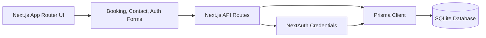
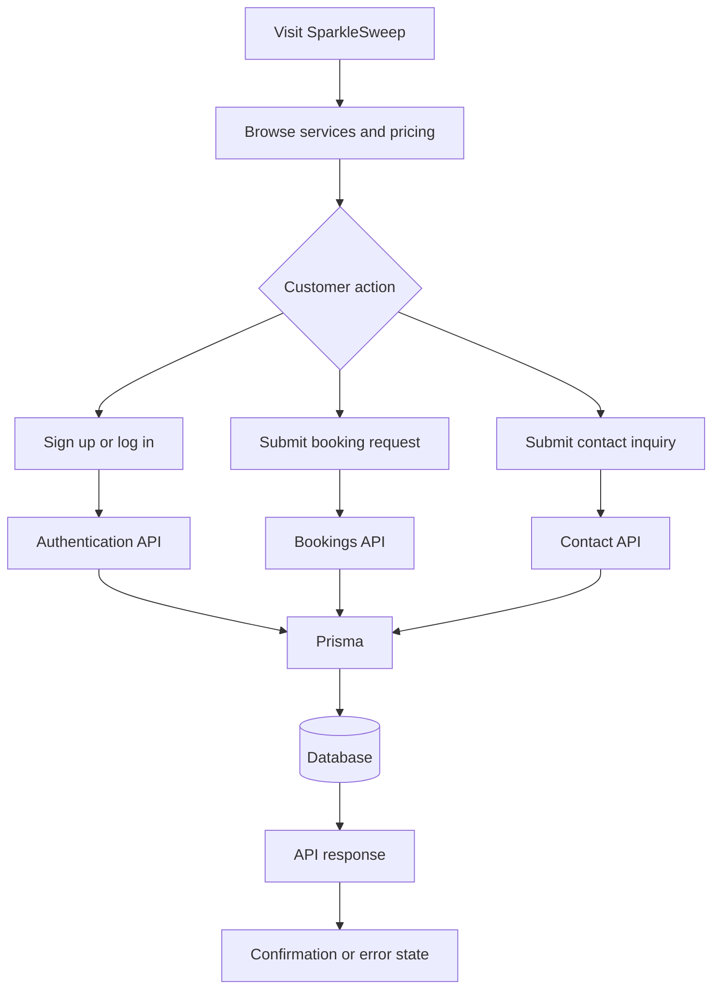

# SparkleSweep

SparkleSweep is a full-stack cleaning service platform for eco-friendly residential and commercial bookings. The application combines a polished customer-facing website with authentication, booking management, contact handling, and Prisma-backed persistence.

## Capabilities

- Responsive marketing experience with homepage, services, pricing, FAQ, and testimonials
- Customer sign-up and login through credentials-based authentication
- Booking workflow with service selection, preferred schedule, validation, and confirmation states
- Contact inquiry workflow with backend persistence
- API routes for bookings, contact messages, registration, and authentication
- Prisma ORM with PostgreSQL (Neon database)
- Reusable UI system built with Tailwind CSS, shadcn/ui, Radix UI, and Lucide icons

## Tech Stack

| Area | Technology |
| --- | --- |
| Framework | Next.js 16, App Router |
| Language | TypeScript |
| UI | React 19, Tailwind CSS, shadcn/ui, Radix UI |
| Icons | Lucide React |
| Authentication | NextAuth credentials provider |
| ORM | Prisma |
| Database | PostgreSQL (Neon) |
| Security | bcryptjs password hashing |
| Package Manager | pnpm |

## System Architecture

SparkleSweep uses a standard full-stack Next.js architecture. Customer-facing pages render the web experience, client forms submit requests to API routes, API handlers validate and process data, Prisma manages database access, and PostgreSQL (Neon) stores local development data.

```text
Frontend pages and forms -> Next.js API routes -> Prisma client -> SQLite database
```

## Architecture Diagram



## Flowchart



## Project Structure

```text
.
|-- app/
|   |-- (site)/                  # Customer-facing pages
|   |-- api/                     # Auth, booking, and contact APIs
|   |-- globals.css
|   `-- layout.tsx
|-- components/
|   |-- ui/                      # Shared UI primitives
|   |-- navbar.tsx
|   |-- footer.tsx
|   `-- page-transition.tsx
|-- hooks/                       # Reusable client hooks
|-- lib/
|   |-- prisma.ts                # Prisma client
|   `-- utils.ts                 # Shared utilities
|-- prisma/
|   |-- schema.prisma            # Data models
|
|-- public/                      # Static assets
|-- styles/                      # Global styles
|-- sparklesweep-presentation.html
|-- package.json
|-- pnpm-lock.yaml
`-- README.md
```

## Data Model

| Model | Purpose |
| --- | --- |
| `User` | Stores customer account and authentication details |
| `Booking` | Stores cleaning appointment requests, service type, schedule, status, and customer details |
| `ContactMessage` | Stores contact form inquiries |

## API Reference

| Route | Method | Purpose |
| --- | --- | --- |
| `/api/auth/signup` | `POST` | Register a customer account |
| `/api/auth/[...nextauth]` | `GET`, `POST` | Handle authentication sessions |
| `/api/bookings` | `POST` | Create a booking request |
| `/api/bookings` | `GET` | Retrieve booking requests |
| `/api/contact` | `POST` | Save a contact inquiry |
| `/api/contact` | `GET` | Retrieve contact inquiries |

## Getting Started

### Prerequisites

- Node.js 18 or newer
- pnpm

### 1. Install Dependencies

```bash
pnpm install
```

### 2. Configure Environment Variables

Create a `.env` file in the project root:

```env
DATABASE_URL="your_database_connection_string"   # e.g., PostgreSQL / Neon
NEXTAUTH_SECRET="replace-with-a-secure-random-secret"
NEXTAUTH_URL="http://localhost:3000"
```

### 3. Initialize Prisma and Database

```bash
npx prisma generate
npx prisma db push
```

### 4. Run the Application

```bash
pnpm dev
```

Open `http://localhost:3000`.

## Backend & Database Setup (Prisma)

Prisma is used as the data access layer for users, bookings, and contact messages.

```bash
# Generate Prisma client
npx prisma generate

# Apply schema changes to the PostgreSQL database
npx prisma db push

# Optional: inspect data in Prisma Studio
npx prisma studio
```

The database schema is defined in `prisma/schema.prisma`, and the PostgreSQL database is configured through `DATABASE_URL`.

## Available Scripts

| Command | Description |
| --- | --- |
| `pnpm dev` | Start the development server |
| `pnpm build` | Create a production build |
| `pnpm start` | Start the production server |
| `pnpm lint` | Run ESLint |

## Roadmap

- Customer dashboard for booking management
- Admin panel for bookings and contact messages
- Email confirmations and reminder notifications
- Payment and invoice support
- Service-area validation and scheduling rules
- Booking reschedule and cancellation workflows

## Summary

SparkleSweep is a full-stack web application that demonstrates the design and implementation of a modern service-based platform. It integrates user authentication, booking workflows, and backend data management into a seamless user experience.

The project focuses on building a scalable and structured system using Next.js and Prisma, while also delivering a clean and user-friendly interface for real-world service interactions. It serves as a strong foundation for extending into a production-ready platform with advanced features such as payments, notifications, and admin controls.

## Acknowledgment

This project was developed as part of a group academic initiative to build a full-stack application using modern web technologies.

## Author

Ambika B Sajjan  
GitHub: https://github.com/Ambika1704  

## License

This project is for educational and demonstration purposes.

## Contributions

Contributions are welcome. You can contribute by:

- Reporting bugs or issues  
- Suggesting new features or improvements  
- Submitting pull requests  
